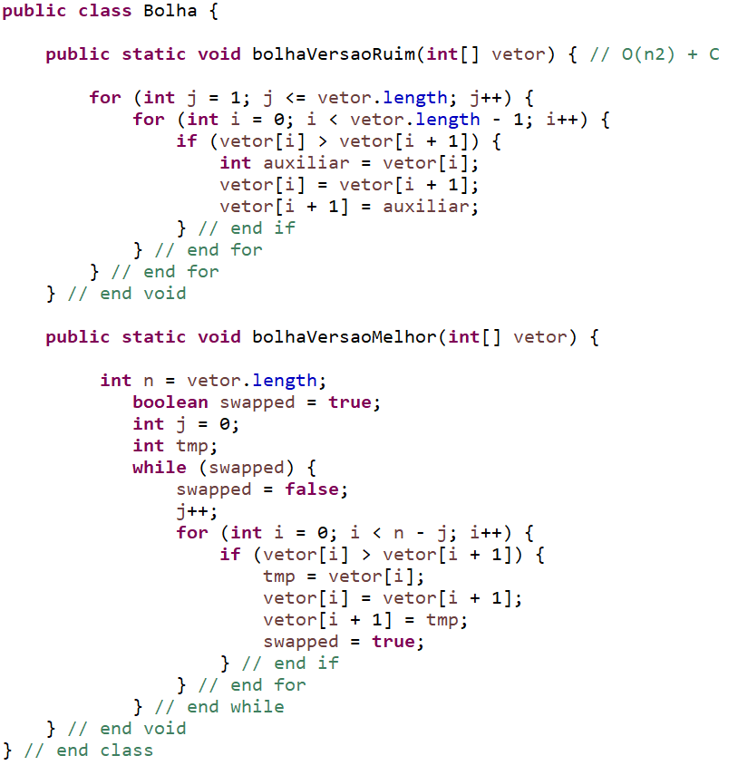
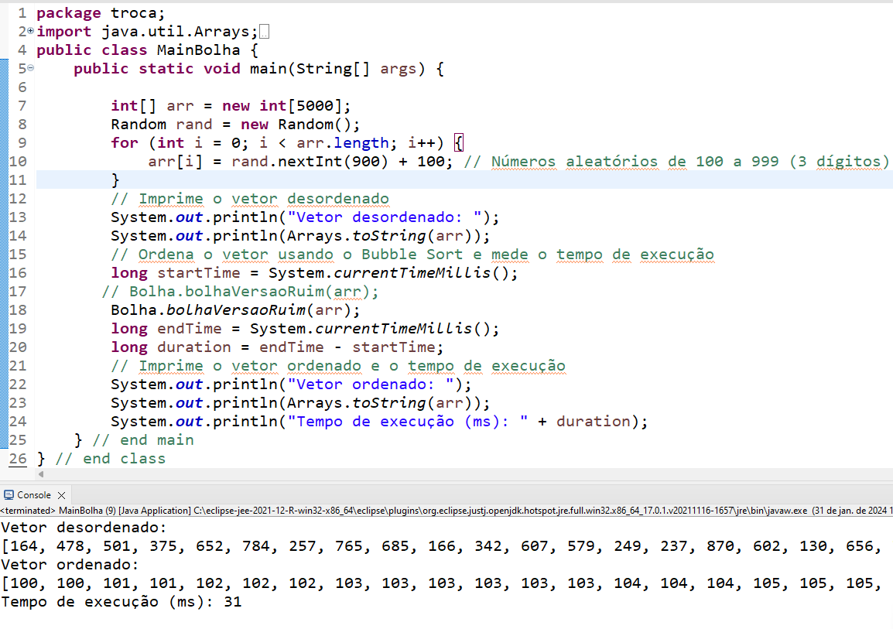

# Algoritmos De Ordenação Bolha.

O algoritmo de ordenação da bolha, também conhecido como Bubble Sort em inglês, é um simples algoritmo de ordenação que opera comparando pares de elementos adjacentes e trocando-os se estiverem na ordem errada. O processo é repetido até que a lista esteja ordenada. O algoritmo recebe o nome "bolha" devido à maneira como os elementos maiores "flutuam" para o topo da lista, assim como bolhas de gás sobem para a superfície da água.

Aqui está uma visão geral básica do funcionamento do algoritmo:

- Começando no início da lista, o algoritmo compara o primeiro par de elementos adjacentes.
- Se o primeiro elemento for maior que o segundo, são trocados. Caso contrário, permanecem na mesma ordem.
- O algoritmo passa para o próximo par de elementos adjacentes e repete o processo.
- Esse processo é repetido para cada par de elementos consecutivos na lista até que toda a lista esteja ordenada.

O algoritmo de ordenação da bolha tem uma complexidade de tempo quadrática, o que significa que seu desempenho piora significativamente para listas grandes. Ele não é eficiente para grandes conjuntos de dados, mas é fácil de entender e implementar. É frequentemente usado apenas para fins educacionais ou quando a simplicidade é mais importante do que a eficiência.

## Bubble Sort - Versão Melhorada

O código a seguir implementa uma versão melhorada do algoritmo de ordenação da bolha (Bubble Sort) para ordenar um array de inteiros em ordem crescente. Vamos analisar o código linha por linha:

- O algoritmo utiliza um loop `while` que continua até que não haja mais trocas durante uma passagem pelo vetor.
- Dentro do loop, há um loop `for` que itera sobre os elementos não ordenados do vetor.
- Durante cada iteração do loop `for`, compara-se elementos adjacentes.
- Se um elemento é maior que o próximo, eles são trocados.
- A variável `swapped` é usada para rastrear se houve alguma troca durante a passagem. Se não houver, isso significa que o vetor está ordenado, e o loop `while` é encerrado.
- A variável `j` é usada para evitar comparar elementos que já foram ordenados nas iterações anteriores, reduzindo o número de comparações desnecessárias.

Essa versão do Bubble Sort melhora o desempenho evitando comparações desnecessárias quando o vetor já está parcialmente ordenado. No entanto, é importante notar que, apesar das melhorias, o Bubble Sort ainda tem complexidade de tempo quadrática e pode não ser eficiente para grandes conjuntos de dados.

## Criação e Inicialização do Vetor:

Um vetor chamado `arr` com 5000 elementos é criado para armazenar números inteiros. Cada elemento do vetor recebe um valor aleatório entre 100 e 999 (inclusive), gerado usando a classe `Random`. Esses valores são gerados para simular um vetor desordenado.

## Impressão do Vetor Desordenado:

O programa imprime no console a mensagem "Vetor desordenado:" seguida dos elementos do vetor desordenado. Isso permite que o usuário veja como o vetor estava antes de ser ordenado.

## Ordenação do Vetor Usando Bubble Sort:

O programa inicia a contagem do tempo (`startTime`) antes de chamar o método `bolhaVersaoRuim` da classe `Bolha`, que contém a implementação do algoritmo Bubble Sort. Após a ordenação, o programa registra o tempo novamente (`endTime`) e calcula a diferença para obter o tempo de execução (`duration`).

## Impressão do Vetor Ordenado e Tempo de Execução:

O programa imprime no console a mensagem "Vetor ordenado:" seguida dos elementos do vetor após a aplicação do Bubble Sort. Também imprime o tempo de execução em milissegundos.

No geral, esse código gera um vetor com valores aleatórios, o imprime desordenado, ordena esse vetor usando o algoritmo de ordenação da bolha e, finalmente, imprime o vetor ordenado e o tempo que levou para realizar essa ordenação. O objetivo provável é demonstrar o funcionamento do algoritmo e comparar seu desempenho com diferentes implementações.
